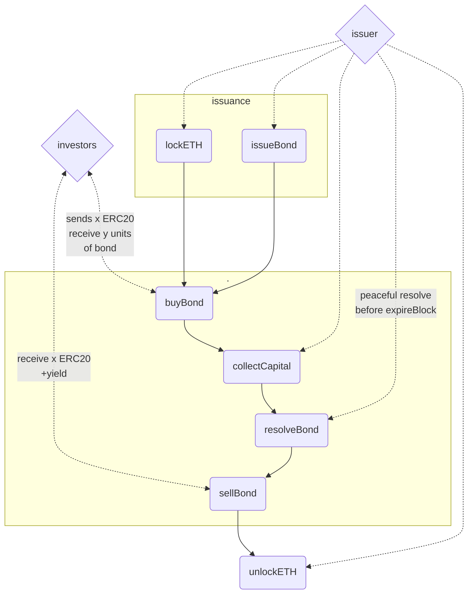
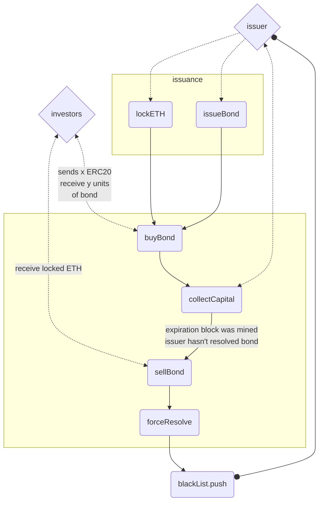

  

> "let's market decide who is reliable enough to take a risk!"
> :dollar: :scroll: :chart: :couple:

  

  

# BondI: Half-Anonymous & Decentralized Bond Creator For ERC20 tokens

  

  

## Table of Contents :link:

  

  

1.  [Start :computer:](#start-computer)

  

  

2.  [Intreduction :memo:](#intreduction-memo)

  

  

	2.1. [Brief concepet :wave:](#brief-concepet-wave)

  

  

3.  [Contract mechanism :factory:](#contract-mechanism-factory)

  

  

	3.1. [Peaceful resolve](#peaceful-resolve)

  

  

	3.2 [Force resolve](#force-resolve)

  

  

## Start :computer:

  

  

In order to install modules and run ganache type in console `make build`. Tests of issue, peaceful resolve and force resolve are ran by `make test` command.

  

  

## Intreduction :memo:

  

  

### Brief concepet :wave:

  

  

A: Concept was born as need to make `DeFi lending` more flexibility. At this moment required security highly exceeds value of borrowed utility.

  

  

 Q: How to make it more flexible :question:

  

  

A: DeFi's lending contracts have common feature. As a anonymous & undisputed mediator it has to exclude any risk. Turning issuer public gives opportunity to include social credibility as a additional security besides locked eth.

  

  

 Q: What is social credibility :question:

  

  

A: It's what makes governments, institutions or companies able to sell bonds even though their potential default would couse investors to loss every penny. Well documented history, recognizability, and trust are nowadays a heart of current capital flow.

  

  

 Q: How to gain it :question:

  

  

A: As any world wide recognizable entities (Coca&Cola, USA etc..) gained it through history. By being reliable and paying debts.

  

  

 Q: Why blockchain :question:

  

  

A: Enormous & anonymous capital from any part of world without any brokers on restrictions.

  

  

 Q: Why BondI :question:

  

A: BondI aims to by fully decentralized and autonomous place for anyone to create bond. It collects every transaction and provide it publicly to rise social credibility of reliable entities. Quantity of `eth` securing a bond is going to be drived by investor's sentiment.

  

  

> "free market is synonym of freedom :fist:"

  

  

## Contract mechanism :factory:

  

  

### Peaceful resolve :rocket:

  

  

Issuer is obligated to give back borrowed ERC20 tokens before expiration phase which was defined by **expireBlocks** argument. In order to do that issuer must set allowance for spender which is BondI smart contract, then call function **peacefulResolves**. This action ends _usage phase_ and puts bond into _expiration phase_ when investors can retrieve borrowed tokens with yield by calling function **sellBond**.

  

  

  

  

### Force resolve :x:

  

  

In case of issuer insolvency, bond’s buyer is allowed to ask for eth that was locked as a bond secure. This action is allowed in _expiration phase_ by calling function **sellBond**.

  

  

